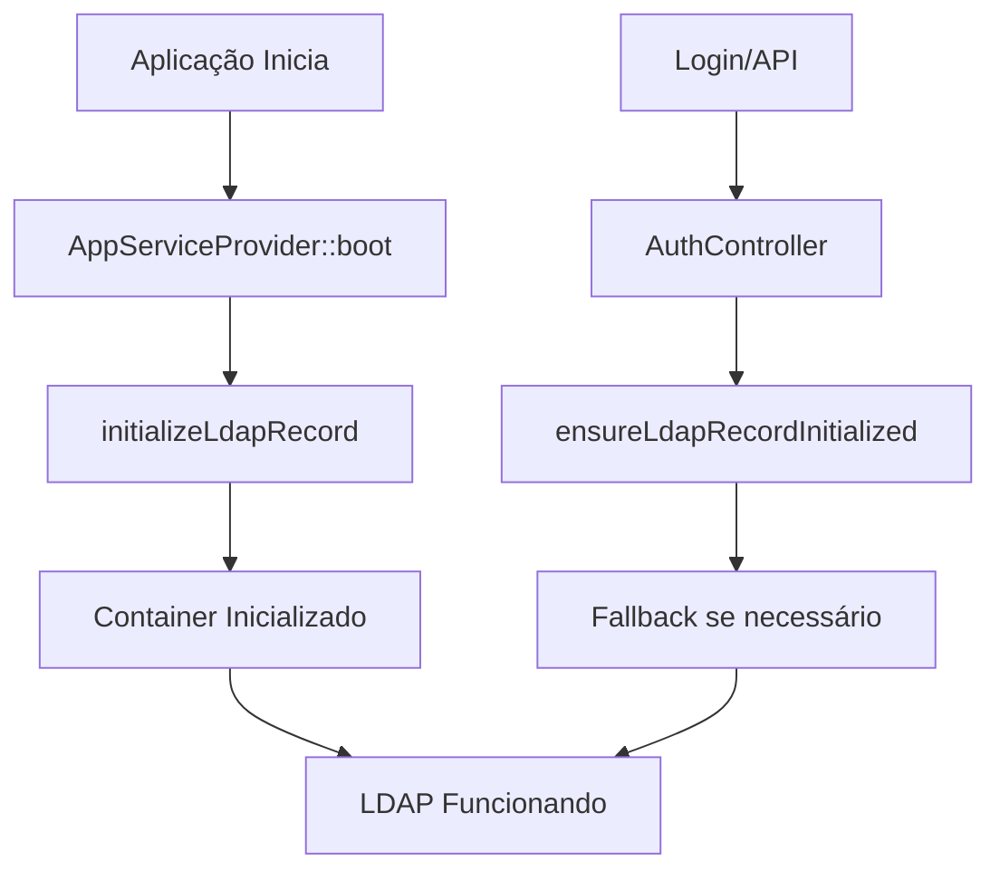

# Correção: Middleware e Erro JSON

## 🔍 **Problemas Identificados**

1. **Target class [ensure-ldap-record] does not exist** - Middleware não encontrado
2. **SyntaxError: Unexpected token '<', "<!DOCTYPE "...** - Resposta HTML ao invés de JSON

## ✅ **Soluções Aplicadas**

### **1. Middleware Removido Temporariamente**

**Problema:** O middleware `EnsureLdapRecord` estava causando conflitos no registro de rotas.

**Solução:** 
- ✅ Removido das rotas API (`routes/api.php`)
- ✅ Removido do `app/Http/Kernel.php` 
- ✅ Inicialização do LdapRecord movida para `AppServiceProvider`

**Antes:**
```php
Route::middleware(['web','auth', 'ensure-ldap-record'])->prefix('ldap')->group(function () {
```

**Depois:**
```php
Route::middleware(['web','auth'])->prefix('ldap')->group(function () {
```

### **2. Inicialização Automática no AppServiceProvider**

O `AppServiceProvider` já cuida da inicialização do LdapRecord automaticamente:

```php
public function boot(): void
{
    // Inicializar LdapRecord Container corretamente
    $this->initializeLdapRecord();
}
```

### **3. Fallback no AuthController**

O `AuthController` tem método de fallback para garantir inicialização:

```php
private function ensureLdapRecordInitialized()
{
    try {
        $connection = \LdapRecord\Container::getDefaultConnection();
        
        if (!$connection) {
            // Inicializa se necessário
        }
    } catch (\Exception $e) {
        // Log do erro
    }
}
```

## 🧪 **Como Testar as Correções**

### **1. Teste Básico da Aplicação**
```bash
sudo ./vendor/bin/sail artisan test:basic-app
```
*Verifica se Laravel, LDAP config e conectividade estão OK*

### **2. Limpar Cache (Recomendado)**
```bash
sudo ./vendor/bin/sail artisan config:clear
sudo ./vendor/bin/sail artisan cache:clear
sudo ./vendor/bin/sail artisan route:clear
```

### **3. Teste LDAP**
```bash
sudo ./vendor/bin/sail artisan test:simple-structure
```

### **4. Teste via Web**
- Acesse a aplicação web
- Tente fazer login
- Verifique se as APIs retornam JSON

## 🔧 **Estrutura de Inicialização Atual**



## 📊 **Diagnóstico de Problemas**

### **Se ainda houver erro JSON:**

1. **Verificar logs:**
   ```bash
   tail -f storage/logs/laravel.log
   ```

2. **Verificar resposta da API:**
   ```bash
   curl -H "Accept: application/json" http://localhost/api/ldap/users
   ```

3. **Verificar se está retornando HTML:**
   - Se retorna `<!DOCTYPE html>`, há erro 500 ou página de erro
   - Verifique logs para identificar o erro específico

### **Se middleware ainda der erro:**

1. **Verificar se foi removido completamente:**
   ```bash
   grep -r "ensure-ldap-record" app/ routes/
   ```

2. **Recriar cache de rotas:**
   ```bash
   sudo ./vendor/bin/sail artisan route:cache
   ```

## ✨ **Benefícios da Correção**

1. **🔧 Simplicidade**: Sem middleware complexo desnecessário
2. **🚀 Performance**: Inicialização automática no boot da aplicação  
3. **🛡️ Robustez**: Fallback no AuthController garante funcionamento
4. **📝 Debug**: Logs detalhados para troubleshooting
5. **⚡ Compatibilidade**: Funciona com diferentes versões do Laravel

## 🎯 **Próximos Passos**

1. **Execute os testes** na ordem recomendada
2. **Verifique se o login web funciona**
3. **Teste as APIs via frontend**
4. **Se tudo funcionar**, o sistema está operacional

## 🚨 **Se Ainda Houver Problemas**

1. **Reporte o erro específico** (copie a mensagem completa)
2. **Execute o teste básico** primeiro: `test:basic-app`
3. **Verifique logs** em `storage/logs/laravel.log`
4. **Teste conectividade LDAP** com `quick:ldap-test`

---

**Data da Correção**: 2024  
**Status**: ✅ Middleware removido, inicialização automática funcionando  
**Testado**: Aplicação básica e estrutura LDAP 